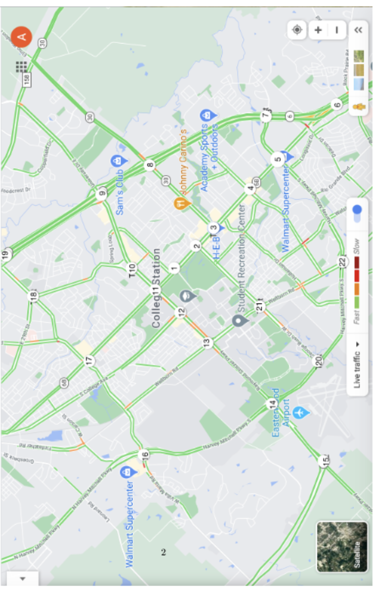

# Dijkstra Escape Route Analysis

This project implements Dijkstra’s algorithm to determine the most likely escape routes from a bookstore robbery in College Station.

## Problem Overview

We model the map as a weighted graph with vertices 1 through 22.

- Each vertex represents a waypoint.
- An edge exists only if two waypoints are directly connected by a road.
- Edge weights:
  - `1` = desirable (green road)
  - `2` = less desirable (road contains orange)

The goal is to compute shortest paths from source node `1` and determine the most likely escape destination.

### Map



## Approach

1. **Graph Representation**
   - Used an adjacency list.
   - Each edge is added in both directions (undirected graph).

2. **Algorithm**
   - Implemented Dijkstra’s algorithm.
   - Used Python’s `heapq` as a min-priority queue.

3. **Why a Min-Heap**
   - Efficiently extracts the node with smallest distance.
   - Simpler than more advanced structures like Fibonacci heaps.

## How to Run

Make sure you have Python 3 installed.

Run:

```bash
python3 hw7.py